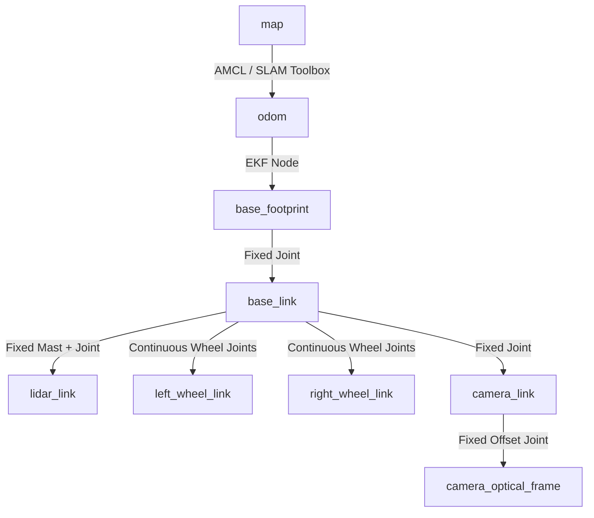

# Helmsman ROS 2 Simulation & Navigation Workspace

Welcome to the **Helmsman** workspace! This is a complete ROS 2 development environment designed to simulate a differential drive mobile robot (**Helmsman**) in Gazebo Sim, configure topic bridges, execute hold-to-drive teleoperation, run SLAM mapping, and execute AMCL localization within a warehouse environment.

This document serves as your **project guide** and **personal developer notes**.

---

## 📂 Workspace Structure

The workspace contains four main packages located under the `src/` directory:

```text
ws/src/
├── helmsman_bringup/          # Unified launch configurations for simulation and navigation
├── helmsman_description/      # URDF / Xacro robot model and RViz display files
├── helmsman_gazebo/           # Gazebo Sim worlds, topic bridges, and teleop nodes
└── helmsman_navigation/       # SLAM & AMCL configuration files and saved maps
```

- **[helmsman_bringup](ws/src/helmsman_bringup)**: Unified launch files to bring up simulation, SLAM mapping, and localization/AMCL stack together.
- **[helmsman_description](ws/src/helmsman_description)**: Defines the physical structure, collision boxes, inertia parameters, visual colors (charcoal body, orange bumpers, teal accents), and sensor configurations of the robot.
- **[helmsman_gazebo](ws/src/helmsman_gazebo)**: Connects the robot model to the Gazebo simulation environment using `ros_gz_sim` and `ros_gz_bridge`. It features a custom hold-to-drive keyboard teleoperation script.
- **[helmsman_navigation](ws/src/helmsman_navigation)**: Manages slam_toolbox and Nav2 localization stack mapping files.

---

## 🤖 Robot Specifications (Helmsman)

The robot configuration is detailed in [helmsman.urdf.xacro](ws/src/helmsman_description/urdf/helmsman.urdf.xacro). Here are the key specifications:

| Component | Parameter | Details | Link / Joint in URDF |
| :--- | :--- | :--- | :--- |
| **Chassis** | Main Body | `0.75m` (L) x `0.50m` (W) x `0.20m` (H) | `base_link` / `base_footprint_joint` |
| **Mass** | Total Weight | `25.0 kg` (main body) + wheels + accessories | `base_link` inertia |
| **Clearance** | Ground Clearance | `0.04m` | offset from `base_footprint` |
| **Drive Wheels** | Differential Wheels | `2x` Radius `0.085m`, Width `0.04m` | `left_wheel_link`, `right_wheel_link` |
| **Casters** | Frictionless Casters | `4x` Radius `0.04m` (Spherical contacts) | `front_left_caster_link` etc. |
| **Lidar** | 2D Lidar Scanner | 360° FOV, Range `0.15m` - `12.0m` at `10Hz` | `lidar_link` / `lidar_joint` |
| **Depth Camera**| RGBD Sensor | `640x480` Resolution, Range `0.1m` - `10.0m`, tilted `12°` down | `camera_link` / `camera_optical_joint` |

### 🛠️ Sensor Placement
* **Lidar**: Mounted on a sensor mast (`0.18m` height, `0.02m` radius) at the rear of the deck (`x: -0.25m` relative to base center).
* **Depth Camera**: Sits at the front center of the robot deck (`x: 0.37m`, tilted slightly downwards to scan for low-profile obstacles).

---

## 🎮 Simulation & Bridge Architecture

Helmsman uses **Gazebo Sim** (formerly Ignition Gazebo) to model physics. The integration relies on:

1. **[helmsman.gazebo.xacro](ws/src/helmsman_description/urdf/helmsman.gazebo.xacro)**:
   - Configures the `gz-sim-diff-drive-system` plugin to run the wheels and calculate odometry.
   - Configures sensor plugins for the `gpu_lidar` and `rgbd_camera`.
   - Attaches `gz-sim-joint-state-publisher-system` to publish wheel spin states.
2. **[bridge.yaml](ws/src/helmsman_gazebo/config/bridge.yaml)**: Defines mappings between ROS 2 topics and Gazebo Sim topics.

### Topic Bridge Mappings
* `/cmd_vel` (`geometry_msgs/msg/Twist`) $\rightarrow$ Drives physics in Gazebo.
* `/odom` (`nav_msgs/msg/Odometry`) $\leftarrow$ Wheel odometry back to ROS 2.
* `/tf` (`tf2_msgs/msg/TFMessage`) $\leftarrow$ Transform updates (specifically base_footprint $\rightarrow$ odom link).
* `/scan` (`sensor_msgs/msg/LaserScan`) $\leftarrow$ 2D scan arrays from the Lidar.
* `/camera/image`, `/camera/depth_image`, `/camera/points`, `/camera/camera_info` $\leftarrow$ RGB, depth map, and point cloud streams.

---

## 🚀 Running the Code: Quick Start Cheatsheet

### 1. Build and Source
Execute these commands in the root of your workspace (`helmsman/ws`):

```bash
# Build the workspace
colcon build --symlink-install

# Source the overlay
source install/setup.bash
```

---

### 2. Visualize the URDF (Independent Test)
To verify your robot design and check parent-child coordinate links without starting any simulation:

```bash
ros2 launch helmsman_description display.launch.py
```
*Launch components defined in [display.launch.py](ws/src/helmsman_description/launch/display.launch.py)*:
- Starts a `robot_state_publisher` containing the URDF layout.
- Spawns a GUI window to manually rotate continuous/revolute joints.
- Opens RViz with the configured `display.rviz`.

---

### 3. Run with Unified Bringup (Recommended)
Instead of launching the simulation and navigation stack in separate terminal windows, you can bring up the complete environment using the unified launch file [helmsman.launch.py](ws/src/helmsman_bringup/launch/helmsman.launch.py) in the `helmsman_bringup` package.

#### A. Simulation + Localization (Default)
By default, the unified launch file starts the Gazebo simulation, spawns the robot in the warehouse, and runs the AMCL localization stack:
```bash
ros2 launch helmsman_bringup helmsman.launch.py
```

#### B. Simulation + SLAM Mapping
To launch the simulation together with SLAM mapping (using `slam_toolbox`) instead of localization:
```bash
ros2 launch helmsman_bringup helmsman.launch.py use_slam:=true
```

#### Launch Configurations/Arguments in [helmsman.launch.py](ws/src/helmsman_bringup/launch/helmsman.launch.py):
* `use_slam` (default: `false`): Set to `true` to run SLAM mapping instead of AMCL localization.
* `use_sim_time` (default: `true`): Use simulation clock (Gazebo Sim) if true.

---

### 4. Step-by-Step / Component Launching (Alternative)
If you prefer to start components individually in separate terminal sessions:

#### A. Launch Simulation in the Warehouse
Starts Gazebo Sim, loads the warehouse map, spawns the robot description, configures topic bridges, and spawns visualization components:
```bash
ros2 launch helmsman_gazebo sim.launch.py rviz:=true teleop:=true
```

##### 🎮 Hold-To-Drive Teleop Node
If `teleop:=true`, a Pygame window will open. Keep this window focused while driving:
* **Drive keys**: `W`/`S` (or `Up`/`Down`) for Forward/Backward, `A`/`D` (or `Left`/`Right`) to Turn.
* **Feature**: Movement occurs **only** while keys are held down. The robot stops immediately upon release. This avoids dangerous lagging/latching.
* **Source implementation**: [keyboard_teleop.py](ws/src/helmsman_gazebo/scripts/keyboard_teleop.py).

##### 🛞 Alternative Terminal Drive (Quick Test)
You can publish velocity commands manually in a terminal using ROS 2 pub:
```bash
ros2 topic pub /cmd_vel geometry_msgs/msg/Twist "{linear: {x: 0.3, y: 0.0, z: 0.0}, angular: {x: 0.0, y: 0.0, z: 0.5}}" -r 10
```

#### B. Run SLAM Toolbox (Mapping)
With the simulation running (and `use_sim_time:=true`), start the asynchronous SLAM node to build a map:
```bash
ros2 launch helmsman_navigation slam.launch.py
```
*Uses parameters from [slam_async.yaml](ws/src/helmsman_navigation/config/slam_async.yaml).*

##### Saving the Map:
Once you have driven around the warehouse and completed the map, open RViz's SLAM Toolbox panel to save the map, or run:
```bash
ros2 run nav2_map_server map_saver_cli -f ~/map_name
```

#### C. Run Localization (AMCL)
If you are navigating on a pre-generated map ([warehouse.yaml](ws/src/helmsman_navigation/maps/warehouse.yaml) and [warehouse.pgm](ws/src/helmsman_navigation/maps/warehouse.pgm)), launch the map server and Adaptive Monte Carlo Localization (AMCL):
```bash
ros2 launch helmsman_navigation localization.launch.py
```
*Launch configurations defined in [localization.launch.py](ws/src/helmsman_navigation/launch/localization.launch.py) use [amcl.yaml](ws/src/helmsman_navigation/config/amcl.yaml).*

*Note: The map server, AMCL localization node, and life cycle manager will coordinate state transitions automatically to enable localization on start.*

---

## 📌 TF tree Structure (Frame Hierarchy)

The following diagram illustrates the Coordinate frames hierarchy active during simulation & navigation:



*Note: In RViz/ROS, camera images and point clouds are oriented relative to `camera_optical_frame` (Z forward, X right, Y down) rather than the standard physical link framework (X forward, Y left, Z up).*

To debug use tf2_tools to listen and generate a graph of tf_frames avaialbe:
```bash
ros2 run tf2_tools view_frames --output frames/tf_frames
```

---

## 💡 Developer Notes & Troubleshooting

> [!NOTE]
> Always check that you have sourced your main ROS 2 installation (e.g., `/opt/ros/humble/setup.bash` or `/opt/ros/jazzy/setup.bash`) before sourcing your local workspace overlays.

> [!IMPORTANT]
> **Keyboard Teleoperation Focus**
> The `keyboard_teleop` uses Pygame. You must click and keep the **"Helmsman teleop - keep focused"** pygame window in the foreground for keys to register. Leaving focus on the terminal or RViz will cause the robot to ignore keystrokes.

> [!TIP]
> **SDF Processing**
> The simulation processes [warehouse.sdf.xacro](ws/src/helmsman_gazebo/worlds/warehouse.sdf.xacro) into a temporary SDF inside your OS temporary folder (`/tmp/helmsman_warehouse.sdf`) on launch. If you make modifications to the obstacles or structures in `warehouse.sdf.xacro`, restarting the launch file will regenerate this file automatically.

> [!WARNING]
> If you launch localization and notice the robot is missing its map reference in RViz, verify that `use_sim_time` is set to `true` on the map server and AMCL. If AMCL starts up before Gazebo publishes simulation time, TF frames will fail to sync.